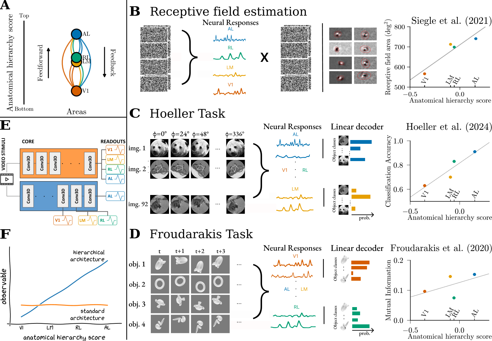
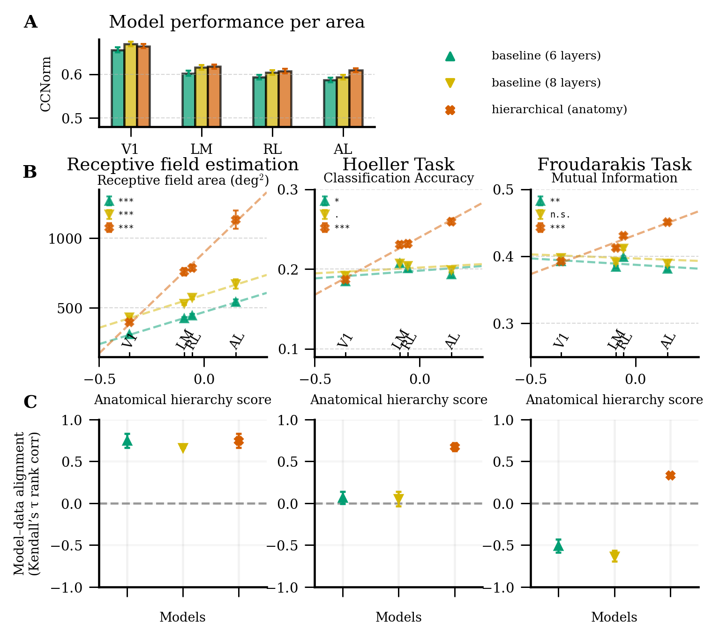

# Anatomically inspired digital twins capture hierarchical object representations in visual cortex

Emanuele Luconi, Dario Liscai, Carlo Baldassi, Alessandro Marin Vargas, Alessandro Sanzeni

---

This repository is the official implementation of [Anatomically inspired digital twins capture hierarchical object representations in visual cortex](https://arxiv.org/abs/2030.12345). 

<p align="center">
</img>
</p>

## Requirements

To install requirements:

```setup
conda create -n anatomically-inspired-dt python=3.11
conda activate anatomically-inspired-dt
pip install -r requirements.txt
```

## Data

You can download the preprocessed MICrONS dataset and the data used to replicate the three experiments by running:

```bash
python utils/download_data.py
```

## Pre-trained Models

You can download pretrained models by running the following command:

```bash
python utils/download_models.py
```

## Training

To train the models in the paper, run this command:

```bash
python scripts/misc/train.py 
    -s 
    --output_dir <output_path>
    --dataset microns30 
    --model_name <model_name> 
    --core <core_type> 
    --readout <readout_type> 
    --shifter
    ...
```

To view all available options and customize your training process further, use the `--help` flag

## Evaluation

To evaluate the models on the evaluation and test sets, run:

```bash
python scripts/misc/eval.py
    --model_data microns30
    --input_data microns30
    --model_name <model_name>
    --input_data_type clips
```

## Experiments' results
To run the benchmark experiments reported in the paper, use the following commands:

```bash
python scripts/experiments/siegle2021/aRF.py
    --model_data microns30
    --model_name <model_name>
    --selected_sessions <session_ids>
```

Otherwise, you can directly download the results shown in the paper by running:

```bash
python utils/download_results.py
```
## Results

<p align="center">
</img>
</p>


## Citation
If you find this work useful in your research, please consider citing:

